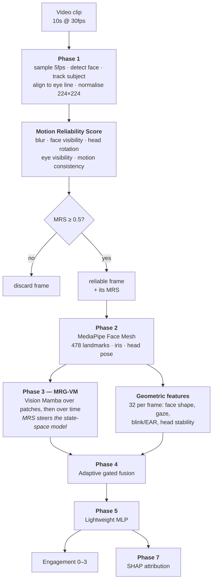

# MRG-VM — How the model works, and what is wrong with it

A single reference for the whole system: the mechanism of each stage, the design
decisions behind it, and an unsparing account of the shortcomings. Written to be
readable by someone who has not seen the code.

Companion documents: [`README.md`](README.md) (quickstart, commands),
[`mrgvm/README.md`](mrgvm/README.md) (Phase 3–7 internals),
[`outputs/README.md`](outputs/README.md) (re-running, scaling),
[`training_log.md`](training_log.md) (run-by-run record).

> **The single most important statement in this document.** Every number here
> comes from a 108-clip sample with **36 training clips across 4 classes**. The
> pipeline is correct; the results are not evidence. Nothing below should be
> reported as a finding about engagement detection without re-running on the full
> 9,068-clip DAiSEE corpus.

---

## Table of contents

1. [What the system does](#1-what-the-system-does)
2. [How each stage works](#2-how-each-stage-works)
3. [Why it is built this way](#3-why-it-is-built-this-way)
4. [What the experiments actually showed](#4-what-the-experiments-actually-showed)
5. [Shortcomings](#5-shortcomings) ← the part that matters for the review
6. [What would make the results trustworthy](#6-what-would-make-the-results-trustworthy)
7. [Honest status of the novelty claim](#7-honest-status-of-the-novelty-claim)

---

## 1. What the system does

Given a 10-second webcam clip of a student, predict their **engagement level on
a 4-point ordinal scale** (0 = very low … 3 = very high), and explain which
behavioural signals drove the prediction.

The central idea is that **not every video frame deserves equal trust**. A frame
where the face is blurred, turned away, or where the detector jittered is worse
evidence than a sharp frontal frame. Most pipelines either ignore this or
hard-discard bad frames. This one computes an explicit per-frame **Motion
Reliability Score (MRS)** and carries it forward into the model itself.



---

## 2. How each stage works

### Phase 1 — Preprocessing and the Motion Reliability Score

**Sampling.** Clips are decoded sequentially and every 6th frame kept (30 fps →
5 fps, ~50 frames per clip). Sequential decode with modulo selection is used
rather than seeking, because seeking in MPEG-4 AVI is both slower and prone to
landing on the wrong frame, and exact native frame indices are needed for
traceability.

**Face detection and subject tracking.** MediaPipe Tasks BlazeFace gives a
bounding box, a confidence, and 6 keypoints (both eyes, nose, mouth, both ear
tragions). DAiSEE was filmed in shared rooms, so **bystanders appear in frame**.
The subject is therefore tracked: on frame 1 the largest, most confident face
wins; afterwards the face nearest the previous accepted centre wins, provided it
is within 1.5 face-widths. Without this, the "primary face" hops to a background
person mid-clip.

**Alignment.** A similarity transform puts the subject's right eye at
(0.35, 0.38) of the output and mirrors the left eye to (0.65, 0.38). Fixing both
eyes pins rotation, scale and translation simultaneously, which is what makes
crops comparable across frames and subjects. The 2×3 affine is stored on every
row, so any downstream coordinate can be projected back to the original frame.

**The MRS.** Five sub-scores, each mapped to [0, 1] where 1 = fully reliable,
combined as a weighted mean (equal weights by default):

| Sub-score | Computed as | Measured on |
|---|---|---|
| `blur` | variance of Laplacian ÷ 150, clipped | **native-resolution** face ROI |
| `face_visibility` | detector confidence (0 if no face) | detection |
| `head_rotation` | `1 − ‖(yaw,pitch,roll)‖ ÷ 60°` | solvePnP / mesh matrix |
| `eye_visibility` | both eyes in-frame and in-box, scaled by eye-aspect-ratio | keypoints + mesh |
| `motion_consistency` | `1 − median optical flow ÷ 8px` | consecutive **aligned** crops |

Two of these deserve explanation:

- **Blur is measured at native resolution, not on the aligned crop.** DAiSEE
  faces are ~130 px and get upscaled to 224. Interpolation smooths, so scoring
  the crop would report every frame as soft regardless of true sharpness.
- **Motion consistency is measured on *aligned* crops.** Alignment has already
  cancelled genuine head translation and roll, so whatever flow remains is
  mostly *detector jitter* — which is exactly the thing worth penalising. Large
  flow here means the box moved, not that the student did.

The two saturation constants were **calibrated on 240 frames across 12 clips
spanning all three splits**, not guessed. Laplacian variance had p50 = 150, which
anchors `blur_var_reference` at the median so the term penalises the blurred tail
without rewarding extra sharpness. Observed inter-frame flow had p95 = 3.6 px, so
the zero-point sits at 8 px ≈ 2.2× p95 — ordinary micro-motion is barely
penalised, genuine jitter is.

Frames scoring below 0.5 are discarded. Clips losing more than 70% of frames are
written to a warnings log rather than silently dropped.

### Phase 2 — Landmarks

MediaPipe Tasks FaceLandmarker runs on the **aligned crops from Phase 1**, not on
the video. This means video decoding is never paid for twice, and Phase 2 depends
only on Phase 1's output tree.

Per retained frame it produces 478 landmarks (468 mesh + 10 iris refinement),
head pose from MediaPipe's own 4×4 facial transformation matrix, an independent
solvePnP cross-check, and simple frame-to-frame track continuity. Because
alignment removed in-plane rotation, the measured roll is added back to the
alignment angle so the reported roll refers to the original frame.

Output: one 1,488-column row per frame, with the DAiSEE labels merged by ClipID.

### Phase 3 — Motion Reliability Guided Vision Mamba

**What Mamba is, briefly.** A state-space model processes a sequence with a
recurrence rather than attention:

```
h_t = exp(dt_t · A) ⊙ h_{t-1} + (dt_t · B_t) · x_t
y_t = ⟨C_t, h_t⟩ + D · x_t
```

The "selective" part (S6) is that `dt`, `B` and `C` are produced *from the input*
at every timestep, so the model chooses what to remember. Cost is linear in
sequence length, versus quadratic for attention.

**Structure.** Each 112×112 crop is split into 49 patches of 16×16 and embedded
to 128 dimensions. Two bidirectional Mamba blocks scan the patch sequence
(spatial), then mean-pool to one vector per frame. Two more bidirectional blocks
scan across the ~50 frames (temporal), then pool to one 128-d vector per clip.

Blocks are **bidirectional** because plain Mamba is causal — correct for
language, wrong for a patch grid or a short clip, where position t+1 is as
informative as t−1.

**Where the reliability guidance enters — the novel claim.** Phase 1 already
discarded frames below threshold, but survivors are not equally trustworthy: MRS
0.52 and MRS 0.95 both pass. Two mechanisms carry that residual reliability into
the model:

1. **`dt` modulation.** `dt` controls how far the hidden state moves per step.
   Scaling it by `0.25 + 0.75·MRS` makes a low-reliability frame *literally
   update the state less*, without masking it or breaking the sequence. A
   transformer has no clean equivalent — the analogous move is an attention-bias
   hack.
2. **Reliability-weighted pooling.** The temporal pool is an MRS-weighted mean.

Both are independently switchable, which is what makes the Phase 6 ablation
possible. **Section 5.2 explains why mechanism 1 turned out not to work.**

### Phase 4 — Adaptive feature fusion

Two streams meet: the 128-d Mamba embedding (learned, dense, opaque) and a
128-d pooled geometric vector (hand-engineered, interpretable).

The geometric stream is 32 per-frame descriptors — 12 computed from the mesh
(face width/height, aspect ratio, mouth openness, brow–eye distances,
asymmetries, whole-mesh deformation energy and velocity, all divided by
inter-ocular distance so they are scale-invariant) plus 20 gaze/blink/head
descriptors — pooled as mean/std/min/max. The four statistics matter: the *std*
of head yaw **is** head-pose stability, and a flat mean would discard exactly the
dynamics the task depends on.

"Adaptive" means the mixture is learned per clip. Both streams project to a
common width, a gate is computed from their concatenation, and the two are
interpolated: `mixed = g·mamba + (1−g)·geometric`. The elementwise product
`m⊙g` is concatenated alongside so information survives when the gate saturates.
The gate is returned with every prediction, so Phase 7 can say which stream drove
it.

### Phase 5 — Lightweight MLP

Two hidden layers (128 → 64) with LayerNorm, GELU and dropout, then 4 logits.
Trained with AdamW, linear warmup into cosine decay, class-weighted
cross-entropy with light label smoothing, early stopping on validation macro-F1.

Deliberately small. At 36 training clips this is not a compromise — it is already
more capacity than the data can constrain.

### Phases 6 and 7 — Ablation and SHAP

Phase 6 trains seven variants, each removing exactly one component, sharing one
seed, one data cache and one schedule so the deltas are attributable.

Phase 7 computes SHAP over the **named** behavioural features rather than raw
embedding dimensions — a Shapley value for "mamba dimension 87" explains nothing
actionable, whereas "blink rate" does. The appearance stream enters as a few PCA
components so its total contribution stays comparable on the same axis.
Attributions are folded into the four behavioural categories the specification
names: eye gaze, blink patterns, head movement, facial dynamics.

---

## 3. Why it is built this way

| Decision | Reason |
|---|---|
| MediaPipe **Tasks** API, not `solutions` | `solutions` was removed from every Python 3.13 wheel at mediapipe ≥ 1.0. Tasks is a superset and adds a facial transformation matrix, giving better head pose than solvePnP on six keypoints. |
| Mamba written by hand in PyTorch | `mamba-ssm` ships a fused CUDA kernel and will not build without `nvcc`; this is a CPU-only machine. Same S6 algorithm, no fused kernel. |
| Phase 2 reads crops, not video | Avoids decoding twice; makes Phase 2 depend only on Phase 1's output. |
| Blur on native ROI | Upscaling makes every crop look soft (§2). |
| Flow on aligned crops | Isolates detector jitter from real motion (§2). |
| `dt` as the injection point for MRS | It is the one knob in an SSM that directly controls how much a timestep moves the state. |
| Subject tracking in Phase 1 | Bystanders are visible in DAiSEE frames. |
| Macro-F1 as the headline metric | Majority-class prediction reaches 0.528 accuracy here; accuracy alone is actively misleading. |
| Split integrity **raises**, not warns | Subject leakage would invalidate every number, so it must not be recoverable by accident. |

---

## 4. What the experiments actually showed

### Model comparison (test split, 36 clips)

| model | macro-F1 | accuracy | QWK |
|---|---|---|---|
| logistic regression on mean-pooled features | **0.349** | 0.306 | 0.201 |
| gaze-only transformer | 0.320 | 0.417 | 0.152 |
| **MRG-VM (full)** | 0.286 | 0.472 | 0.170 |
| cross-attention transformer fusion | 0.181 | 0.167 | 0.135 |
| majority class | 0.173 | **0.528** | 0.000 |
| naive late fusion | 0.126 | 0.167 | 0.100 |
| affect-only transformer | 0.087 | 0.111 | 0.011 |

Read the two bold cells together: the trivial majority predictor has the
**highest accuracy of any model** and the second-lowest macro-F1. That is the
trap this dataset sets, and it is why accuracy never appears alone anywhere in
this project.

### Ablation (test split)

| variant | macro-F1 | Δ vs full | val macro-F1 | params |
|---|---|---|---|---|
| `no_vision_mamba` (geometry only) | **0.407** | **+0.121** | 0.236 | 42k |
| `concat_fusion` | 0.287 | +0.001 | 0.342 | 1.12M |
| `full` | 0.286 | — | 0.392 | 1.17M |
| `guide_pooling_only` | 0.286 | +0.000 | 0.392 | 1.17M |
| `no_mrs_guidance` | 0.261 | −0.025 | 0.389 | 1.17M |
| `guide_delta_only` | 0.261 | −0.025 | 0.389 | 1.17M |
| `no_landmarks` (Mamba only) | 0.052 | −0.234 | 0.194 | 1.09M |

### SHAP (surrogate fidelity 1.000)

| behavioural group | share of total \|SHAP\| |
|---|---|
| facial dynamics | 41.1% |
| head movement | 23.2% |
| eye gaze | 19.3% |
| blink patterns | 11.9% |
| **appearance (Vision Mamba)** | **4.5%** |

Three independent measurements agree that the learned appearance stream is
contributing almost nothing: the ablation (removing it *helps*), SHAP (4.5%), and
the fusion gate (0.493, range 0.350–0.625 — barely committing either way).

---

## 5. Shortcomings

Ordered by how much they should change what you claim.

### 5.1 The sample is far too small for any result to mean anything

36 training clips, 36 validation, 36 test, over 4 ordinal classes. Minority
classes hold 3–6 clips per split. A single test clip moving between classes
shifts macro-F1 by several points.

**Direct evidence that the numbers are noise-dominated:** the best test variant
(`no_vision_mamba`, 0.407) has the **worst validation score** (0.236). Early
stopping selects on validation, so the training loop would never have chosen the
configuration that happens to win on test. When the val and test rankings invert
like that, the gaps are not measuring anything stable.

**Rule of thumb for reading the ablation table:** at n=36, treat any macro-F1
difference under roughly ±0.10 as indistinguishable from seed noise. That covers
every row except `no_landmarks`.

Every training script prints the per-split class distribution and a warning for
each class under five clips *before* it trains, so this cannot be overlooked.

### 5.2 Half of the novel contribution does not work

This is the most important technical shortcoming, and it is worth stating
plainly rather than burying.

Of the two reliability-guidance mechanisms, **only pooling affects predictions**.
`full` and `guide_pooling_only` score identically to four decimal places, as do
`no_mrs_guidance` and `guide_delta_only`. Toggling `dt` guidance flips **zero**
predictions.

This was investigated rather than assumed. With weights held identical, the
outputs *do* differ — by ~7×10⁻⁵ relative on the clip embedding — so the
mechanism is correctly wired. **It is the parameterisation that fails, and the
cause is the data.** Once Phase 1 has gated, retained-frame MRS is 0.93 ± 0.049.
The map `0.25 + 0.75·MRS` therefore yields a multiplier of 0.95 ± 0.037 — under
4% relative spread. A near-constant rescale of `dt` is precisely what the learned
`dt_proj` bias absorbs during training.

So the novel contribution, as parameterised, reduces to **MRS-weighted pooling**,
worth +0.025 test macro-F1 — itself well inside the noise band from §5.1.

**The implemented fix:** `delta_map='clip_normalised'` standardises MRS *within
each clip* before mapping, so `dt` responds to how reliable a frame is *relative
to its own clip* rather than to a near-constant absolute score. Measured **8.3×
stronger** on the same batch. It is not the default, so the published ablation
stays reproducible — but it is the first thing to try at full scale.

### 5.3 The Vision Mamba branch is not earning its place

Removing 1.1M parameters of learned appearance *improves* test macro-F1 from
0.286 to 0.407; removing the 32 hand-engineered landmark features collapses the
model to 0.052. The 42k-parameter geometry-only variant is the best model in the
entire project.

Subject to the §5.1 caveat, the defensible reading is **"the deep branch has no
data to learn from yet"**, not "geometry beats Vision Mamba". A 1.17M-parameter
backbone trained on 36 clips is unconstrained; the strongly regularised
alternatives are not. Train macro-F1 reaches 0.570 against 0.392 validation,
which is the overfitting signature you would expect.

### 5.4 Adaptive fusion is indistinguishable from concatenation

0.287 vs 0.286, with the gate sitting at 0.493 and spanning only 0.350–0.625 —
it never commits to either stream. At this sample size the gate has nothing to
learn. It is not shown to be useless; it is shown to be *untested*.

### 5.5 The MRS frame gate has never actually been evaluated

No ablation row tests it, and this is structural: by Phase 6, Phase 1 has already
discarded the sub-threshold frames, so undoing the gate requires re-running
Phase 1 with `--mrs-threshold 0`.

On this sample that experiment is vacuous anyway — **the gate rejected 1 frame
out of 5,403**. The sample clips are uniformly good quality, so there was nothing
for the gate to reject. The filtering half of the MRS contribution is therefore
completely unmeasured, and will stay that way until the pipeline is run on data
containing genuinely bad frames.

### 5.6 Two engineered features carry no information

- **`fixation_ratio` is ≈1.0 for nearly every clip.** Phase 1 samples at 5 fps
  (200 ms between frames) while a real saccade lasts 30–80 ms. The I-VT velocity
  threshold therefore almost never fires. **What this feature actually measures
  is the rate of gaze shifts between samples, not a saccade rate**, and it must
  not be described as the latter in any writeup. Raising `--sample-fps` narrows
  the gap.
- **`off_screen_ratio` is 0.0 for every clip.** Subjects genuinely look at the
  screen throughout, so the feature has zero variance on this data.

Both are documented at their definition sites in `src/features.py`.

### 5.7 Methodological gaps

- **Single seed everywhere.** No variance estimate on any number. This is the
  cheapest fix available (`--seed`) and the prerequisite for treating Phase 6 as
  evidence.
- **No cross-validation.** With 16 subjects, leave-one-subject-out would give far
  more stable estimates than a fixed 4/4/8 split, at 16× the compute.
- **No hyperparameter search.** The specification's Phase 5 asks for
  hyperparameter optimisation; the current values are reasoned defaults, not
  tuned ones. Tuning on 36 clips would mostly fit the validation split.
- **SHAP is computed over a surrogate.** A RandomForest is fitted to MRG-VM's own
  predictions, because KernelSHAP against the torch model would need thousands of
  forward passes through the selective scan. Fidelity is measured and reported —
  currently 1.000, meaning the surrogate reproduces the model exactly on this
  sample, so the attributions are trustworthy *here*. On more data fidelity will
  drop and must be re-checked; the script warns below 0.8.

### 5.8 Implementation constraints

- **The Mamba scan is a Python loop.** No fused CUDA kernel, so it is roughly an
  order of magnitude slower than `mamba-ssm`. Fine at 49 and 50 timesteps
  (~0.5 s per batch forward, ~22 s per epoch), but it is why `image_size` defaults
  to 112 rather than 224. On a CUDA machine, swap in `mamba-ssm` and raise the
  resolution — the interfaces already match.
- **`timm` is pinned below 1.0.** The HSEmotion checkpoints were pickled against
  timm 0.x and fail at *inference* (not load) under ≥ 1.0 with
  `AttributeError: DepthwiseSeparableConv.conv_s2d`.
- **PyTorch ≥ 2.6 needs a scoped `weights_only=False`** to load those same
  checkpoints.
- **The affect branch is not OpenFace.** OpenFace 2.0 is not a pip package, so
  HSEmotion (frozen EfficientNet-B0, AffectNet) is used instead. **Consequence
  for the writeup: the affect channel is *categorical expression*, not
  *action-unit intensity*, so AU-level interpretability claims no longer apply.**
  Blink detection likewise substitutes eye-aspect-ratio for AU45, with a
  per-clip adaptive threshold since EAR baseline varies with face shape and
  eyewear.

### 5.9 Dataset and scope limits

- **The sample is not representative of DAiSEE's imbalance.** Engagement counts
  here run roughly 4/6/16/10 across classes 0–3. Full DAiSEE has ~1% in class 0.
  Expect macro-F1 to fall and class weighting to matter much more.
- **DAiSEE is university students, not children.** The wider project targets
  child engagement; no child engagement corpus with these modalities exists. Age
  transfer must be reported as a measured result, never assumed.
- **Two components remain stubs** (signatures fixed, logic not written):
  `src/early_detection.py` (predicting clip *t+1* from clip *t*) and
  `src/explain.py` (attention rollout and deletion test for the transformer
  baselines — Phase 7 SHAP for MRG-VM *is* implemented).
- **Clip ordering is inferred, not documented.** `ClipID = <6-digit SubjectID><suffix>`;
  left-pad the suffix to 4 digits, first digit is the session, last three a
  strictly-increasing within-session index. This comes from the ID pattern, not
  from the DAiSEE authors, and indices are not dense (subject 110001 jumps
  1012 → 1040 → 1048), so only gap-of-1 pairs are safely adjacent.

---

## 6. What would make the results trustworthy

In descending order of value per unit of effort:

1. **Run on the full DAiSEE** (9,068 clips). Everything scales unchanged; only
   `--input-root` differs. Budget 3–5 hours single-threaded and ~7 GB with
   `--image-format jpg`. This alone addresses §5.1, §5.3 and §5.4.
2. **Multiple seeds per ablation variant** (3–5). One-line change. Without this
   the Phase 6 table cannot be reported as evidence.
3. **Test `delta_map='clip_normalised'`** — the fix for §5.2, already implemented
   and measured 8.3× stronger.
4. **Re-run Phase 1 at `--mrs-threshold 0`** on data with genuinely bad frames,
   to finally measure the frame gate (§5.5).
5. **Leave-one-subject-out cross-validation** for stable estimates.
6. **Raise `--sample-fps`** to 10 or 15 so the fixation/saccade features become
   meaningful (§5.6).
7. On a CUDA machine, swap in `mamba-ssm` and raise `image_size` to 224.

---

## 7. Honest status of the novelty claim

The specification presents two novel contributions. Their current standing:

**The Motion Reliability Score (Phase 1) — implemented, calibrated, unevaluated.**
The score itself is well-founded: five sub-scores with data-calibrated constants,
each measured on the right image at the right resolution for defensible reasons.
But its *filtering* effect is unmeasured (§5.5, the gate rejected 1 frame in
5,403) and its *guidance* effect reduces to weighted pooling worth +0.025, inside
the noise band (§5.2). The claim "MRS improves engagement detection" is currently
**unsupported** — not refuted, unsupported.

**Reliability-guided Vision Mamba (Phase 3) — implemented and verified correct,
but not yet shown to help.** The Mamba is genuine (gradients finite,
bidirectionality confirmed by perturbation testing, selective scan matching the
published recurrence). The guidance mechanism is real and wired correctly. But
the branch it lives in is currently *subtracting* from performance (§5.3), and
one of its two mechanisms is inert on this data (§5.2).

**What can be claimed right now, defensibly:**

- A complete, reproducible seven-phase pipeline that runs end-to-end on real
  DAiSEE data and scales unchanged to the full corpus.
- A per-frame reliability score with data-calibrated constants and a principled
  injection point into a state-space model — a mechanism that has no clean
  transformer equivalent.
- An ablation harness that isolates each component, and which was rigorous enough
  to expose that one of the project's own mechanisms does not fire.
- Explainability that reports its own fidelity rather than assuming it.

**What cannot be claimed:** that any of it improves engagement detection. That
requires the full dataset and multiple seeds.

The most valuable output of this work so far is arguably §5.2 — an ablation
honest enough to catch a headline mechanism doing nothing, together with a
diagnosed cause and an implemented fix. That is a better position to be in than a
table of favourable numbers nobody has stress-tested.
